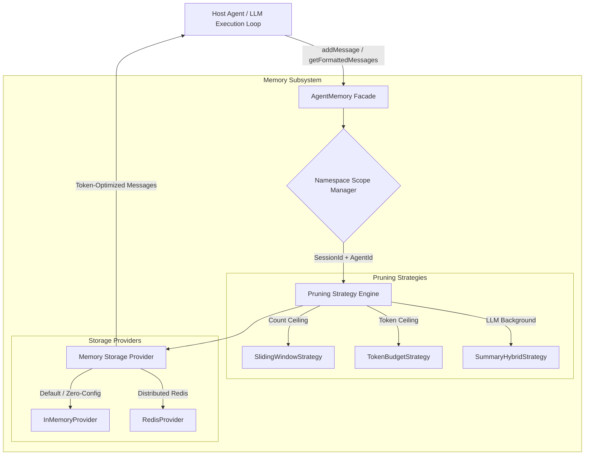

# 🧠 BugBaar Engine: Agent Memory & Context Manager Subsystem (`agents/memory`)

> **A zero-dependency by default, pluggable, type-safe Agent Memory & Context State Manager designed for autonomous AI agents, multi-agent networks, and LLM orchestration pipelines.**

---

## 📌 Executive Summary

Building production-ready AI agents requires managing conversational history, context window constraints, and multi-agent state. Standard implementations often suffer from:
1. **Context Window Overflow**: Passing raw message arrays to LLMs eventually exceeds token boundaries.
2. **Infrastructure Lock-In**: Forcing heavy vector DBs or external Redis instances breaks rapid local development and quick prototyping.
3. **Multi-Agent Memory Pollution**: Multiple agents operating in a shared session overwrite each other's scratchpads.
4. **Tool Call Truncation Crashes**: Pruning history can leave orphaned `tool` result messages without their matching `assistant` tool-call prompt, triggering 400 Bad Request errors from LLM APIs.

The **BugBaar Engine Memory Subsystem** solves these challenges by providing a **decoupled, plug-and-play facade**. It allows any agent or workflow to store, scope, prune, and retrieve context without locking the application into a specific storage driver or LLM provider.

---

## 🏗️ Architecture Overview

The subsystem follows the **Provider & Strategy Design Patterns**, separating storage drivers from context window pruning logic.



---

## 📂 Folder Structure

```text
agents/memory/
├── interfaces/
│   ├── message.interface.ts     # BaseMessage models & Zod runtime schemas
│   ├── provider.interface.ts    # IMemoryProvider contract & MemoryNamespace definition
│   └── strategy.interface.ts    # IContextStrategy contract & StrategyOptions
├── providers/
│   ├── in-memory.provider.ts    # Default zero-dependency storage provider
│   └── redis.provider.ts        # Distributed Redis provider adapter with fallback
├── strategies/
│   ├── sliding-window.strategy.ts # Count-based message window pruning
│   ├── token-budget.strategy.ts   # Token-ceiling pruning + Tool Pair Sanitization
│   └── summary-hybrid.strategy.ts # Lazy context condensation + recent turns
├── utils/
│   └── token-counter.util.ts    # Fast lightweight token estimator
├── agent-memory.ts              # Main facade class with 4-tier fallback handling
├── index.ts                     # Public SDK module export barrel
└── __tests__/
    ├── agent-memory.test.ts     # Core integration tests (9 passing tests)
    └── realtime-scenarios.test.ts # Advanced real-time & fault injection tests (5 passing tests)
```

---

## 🧩 Module Responsibilities

| Module / Layer | Primary Responsibility | Key Files |
| :--- | :--- | :--- |
| **Interfaces** | Defines strongly typed schemas (`User`, `Assistant`, `System`, `ToolResult`), Zod validation models, and core provider/strategy contracts. | `interfaces/*.ts` |
| **Providers** | Manages raw persistence. Defaults to an ultra-fast `InMemoryProvider`. Offers a `RedisProvider` with automatic fallback. | `providers/*.ts` |
| **Strategies** | Executes context window pruning algorithms before delivering messages to LLMs. Ensures token ceiling compliance and tool-call pair integrity. | `strategies/*.ts` |
| **Utils** | Estimates token overhead for raw text, JSON metadata, and tool call objects without requiring heavy native binaries. | `utils/token-counter.util.ts` |
| **Facade (`AgentMemory`)** | Serves as the primary public API. Orchestrates namespaces, strategy options, and executes 4-tier emergency fallback logic. | `agent-memory.ts` |

---

## 🔥 Key Technical Features

### 1. Tool Call Pair Atomicity & Sanitization
LLM APIs (OpenAI, Anthropic) require that a `role: 'tool'` response **must** follow an `assistant` message containing matching `toolCalls`. If pruning removes the `assistant` call, sending an orphaned `tool` message causes an API HTTP 400 crash.
* **Our Solution**: Both `TokenBudgetStrategy` and `SlidingWindowStrategy` include automatic `sanitizeToolCallPairs()` filtering to safely strip orphaned tool results when their parent call gets truncated.

### 2. Dual-Namespace Scoping (`sessionId` + `agentId`)
Prevents memory contamination in multi-agent networks:
* **Private Agent Memory**: Scope by `{ sessionId: 'user-1', agentId: 'coder' }`.
* **Shared Team Memory**: Omit `agentId` to create a common workspace buffer (`{ sessionId: 'user-1' }`).

### 3. 4-Tier Emergency Fallback Matrix
Guarantees **99.99% agent execution uptime**. Memory operations (writing, pruning, reading) **never** throw unhandled exceptions:
* **Tier 1 (LLM Summarizer Failure)**: Degrades to sliding window context truncation.
* **Tier 2 (Storage Outage)**: Automatically falls back to internal `InMemoryProvider`.
* **Tier 3 (Malformed Payload)**: Intercepts and sanitizes invalid schemas via Zod.
* **Tier 4 (Token Emergency Overflow)**: Emergency hard-truncates history to fit context limits.

---

## 💻 Developer Quickstart & Code Examples

### Example 1: Zero-Config Setup (3 Lines of Code)
```typescript
import { AgentMemory } from './agents/memory';

// Initialize with zero configuration (InMemory + TokenBudgetStrategy by default)
const memory = new AgentMemory();

// Add messages cleanly
await memory.addMessage({ role: 'user', content: 'What is the placement drive status?' });
await memory.addMessage({ role: 'assistant', content: 'Drives are currently active.' });

// Retrieve token-optimized context ready for LLM invocation
const messages = await memory.getFormattedMessages();
```

### Example 2: Handling Tool Calls & Results
```typescript
import { AgentMemory } from './agents/memory';

const memory = new AgentMemory();

// Save assistant tool call
await memory.addMessage({
  role: 'assistant',
  content: 'Executing search...',
  toolCalls: [{
    id: 'call_abc123',
    name: 'searchPlacementDB',
    arguments: '{"department":"CS"}'
  }]
});

// Save tool result
await memory.addMessage({
  role: 'tool',
  toolCallId: 'call_abc123',
  content: '{"matches":5}'
});
```

### Example 3: Production Setup (Token Budget + Redis + Multi-Agent Isolation)
```typescript
import { 
  AgentMemory, 
  RedisProvider, 
  TokenBudgetStrategy 
} from './agents/memory';

const memory = new AgentMemory({
  provider: new RedisProvider({ host: 'localhost', port: 6379 }),
  strategy: new TokenBudgetStrategy(4000),
  namespace: {
    sessionId: 'session-xyz-2026',
    agentId: 'researcher-agent-01'
  }
});
```

---

## 🧪 Testing & Verification

The subsystem includes a comprehensive test suite covering **14 unit and integration tests** across 2 test suites.

### Running Unit & Integration Tests
```bash
npm test
```

### Running Interactive Demos
```bash
# Basic Usage Demo
npm run demo

# Advanced Multi-Agent Real-Time Simulation Demo
npm run demo:advanced
```

---

## 🛠️ Extending the Subsystem

### Adding a Custom Storage Provider
Implement the `IMemoryProvider` interface:
```typescript
import { IMemoryProvider, MemoryNamespace, BaseMessage } from './interfaces';

export class CustomDatabaseProvider implements IMemoryProvider {
  async saveMessage(namespace: MemoryNamespace, message: BaseMessage): Promise<void> { /* ... */ }
  async getMessages(namespace: MemoryNamespace): Promise<BaseMessage[]> { /* ... */ }
  async clear(namespace: MemoryNamespace): Promise<void> { /* ... */ }
}
```

### Adding a Custom Pruning Strategy
Implement the `IContextStrategy` interface:
```typescript
import { IContextStrategy, StrategyOptions, BaseMessage } from './interfaces';

export class CustomPruningStrategy implements IContextStrategy {
  async prune(messages: BaseMessage[], options?: StrategyOptions): Promise<BaseMessage[]> {
    // Custom pruning logic
    return messages;
  }
}
```

---

## 🤝 Contributing

Built with ❤️ by the **BugBaar Community**.  
Contributions, bug reports, and feature requests are welcome!
